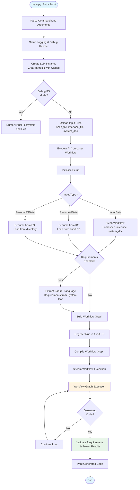
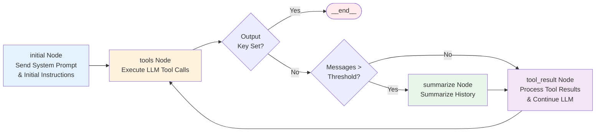
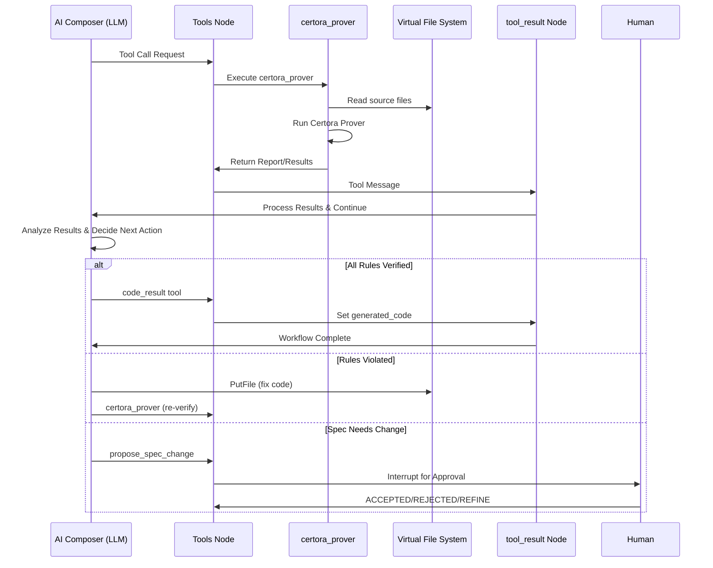
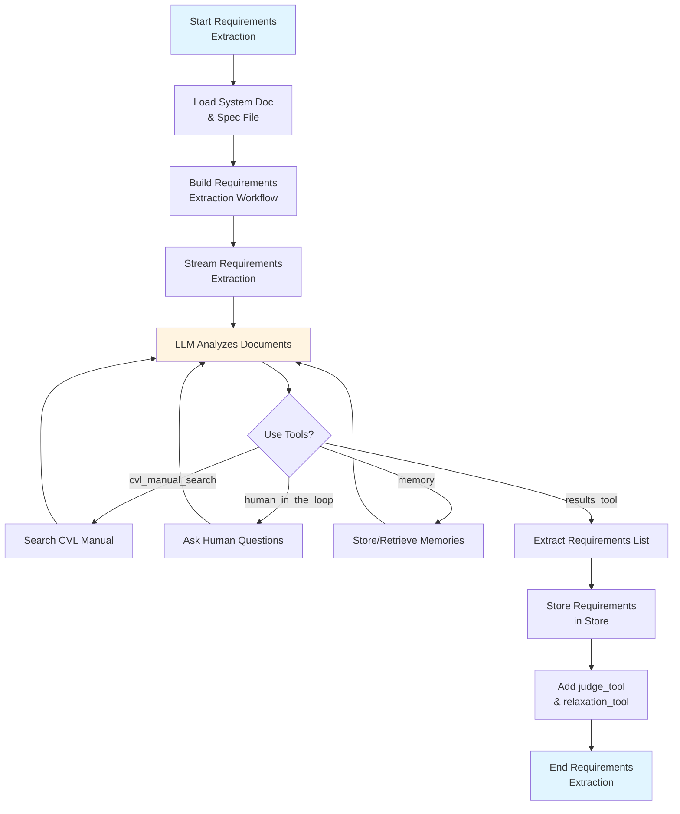
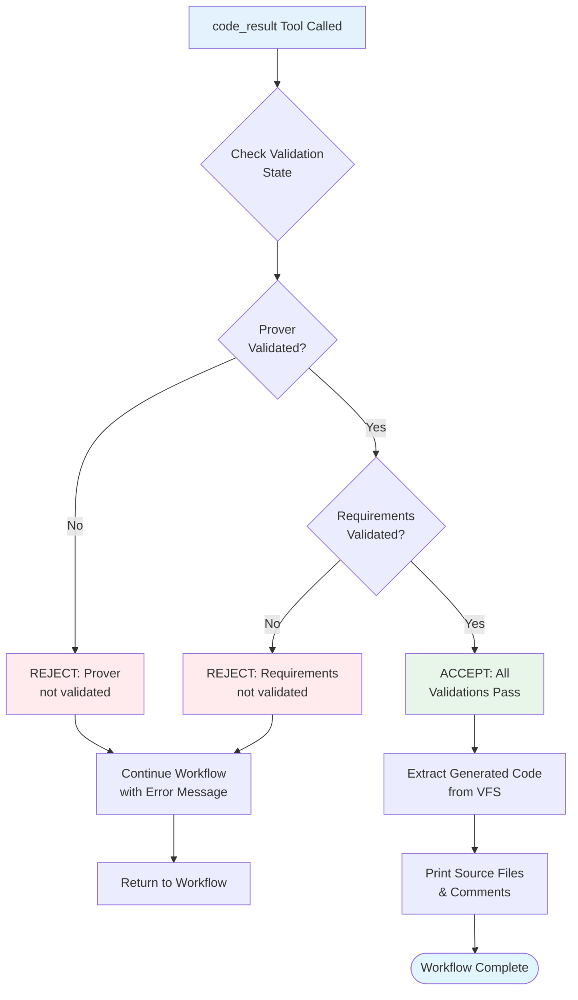
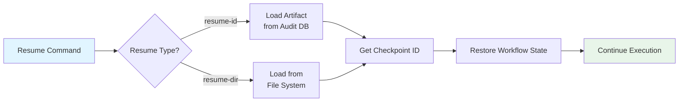

# AI Composer Flow Diagram

This document provides a visual overview of the AI Composer workflow to help code contributors understand the system architecture and execution flow. The AI Composer generates verified smart contract implementations from documentation and CVL (Certora Verification Language) specifications.

## High-Level Flow

## Workflow Graph Structure

The core workflow graph follows a standard LangGraph pattern with the following nodes:

**How it works:**

LangGraph is a framework for building stateful, multi-actor applications with LLMs. The workflow follows a simple loop pattern:

1. **initial Node**: Runs once at the start, sends the system prompt and initial instructions to the LLM.
2. **tools Node**: Executes any tool calls that the LLM requested (e.g., `certora_prover`, `PutFile`, etc.).
3. **Routing Decision**: After tools execute, the graph checks:
   - If `generated_code` is set → workflow ends
   - If message count exceeds threshold → route to `summarize` (optional, reduces context size)
   - Otherwise → route to `tool_result`
4. **tool_result Node**: Sends tool results back to the LLM, which then decides what to do next (call more tools, fix code, or complete).
5. **Loop**: The graph loops back to `tools` node, creating an iterative cycle until the LLM calls the `code_result` tool to signal completion.

This pattern allows the AI Composer to iteratively write code, verify it with the prover, fix issues, and repeat until all specifications are satisfied.

## Available Tools

The AI Composer has access to the following tools during execution:

```mermaid
graph TB
    Tools[Available Tools] --> CoreTools[Core Tools]
    Tools --> VFSTools[VFS Tools]
    Tools --> ConditionalTools[Conditional Tools]
    
    CoreTools --> Prover[certora_prover<br/>Run Certora Prover<br/>to verify contracts]
    CoreTools --> SpecChange[propose_spec_change<br/>Propose spec modifications<br/>requires human approval]
    CoreTools --> HumanLoop[human_in_the_loop<br/>Request human assistance]
    CoreTools --> CodeResult[code_result<br/>Mark completion<br/>submit final code]
    CoreTools --> CVLSearch[cvl_manual_search<br/>Search CVL documentation]
    
    VFSTools --> PutFile[PutFile<br/>Write files to VFS]
    VFSTools --> GetFile[GetFile<br/>Read files from VFS]
    VFSTools --> ListDir[ListDirectory<br/>List directory contents]
    VFSTools --> DeleteFile[DeleteFile<br/>Remove files from VFS]
    
    ConditionalTools --> JudgeTool[judge_tool<br/>Validate requirements<br/>if requirements enabled]
    ConditionalTools --> Relaxation[requirements_relaxation<br/>Request requirement relaxation<br/>if requirements enabled]
    ConditionalTools --> Memory[memory<br/>Persistent memory tool<br/>if beta features enabled]
    
    style CoreTools fill:#e3f2fd
    style VFSTools fill:#fff3e0
    style ConditionalTools fill:#f3e5f5
```

## Tool Execution Flow

## Requirements Extraction Flow (Optional)

When requirements are enabled, the system first extracts natural language requirements:

## Validation & Completion Flow

Before the workflow completes, the system validates that all requirements are met:

## Key Components

### State Management
- **AIComposerState**: Main state containing messages, VFS, validation status, and generated_code
- **AIComposerContext**: Context with LLM, RAG DB, prover options, VFS materializer, and required validations
- **Input**: Input schema with input messages and initial VFS state

### Persistence
- **PostgresSaver**: Checkpoints workflow state for resumption
- **PostgresStore**: Stores requirements and other metadata
- **AuditDB**: Tracks runs, artifacts, and completion status
- **PostgresMemoryBackend**: Persistent memory for requirements and composer context

### Key Files
- `main.py`: Entry point
- `composer/workflow/executor.py`: Main workflow execution logic
- `composer/workflow/factories.py`: Workflow graph builder
- `graphcore/graph.py`: Core workflow graph construction
- `composer/tools/`: Individual tool implementations
- `composer/natreq/extractor.py`: Requirements extraction
- `composer/natreq/judge.py`: Requirements validation

## Resume Workflow

The system supports resuming workflows from checkpoints:

## Human Interaction Points

The workflow can be interrupted for human input at several points:

1. **propose_spec_change**: When the AI Composer wants to modify the specification
2. **human_in_the_loop**: When the AI Composer needs clarification or assistance
3. **Requirements Extraction**: When extracting requirements, the AI Composer may ask questions
4. **Debug Handler**: Ctrl+C during execution to access debug console
